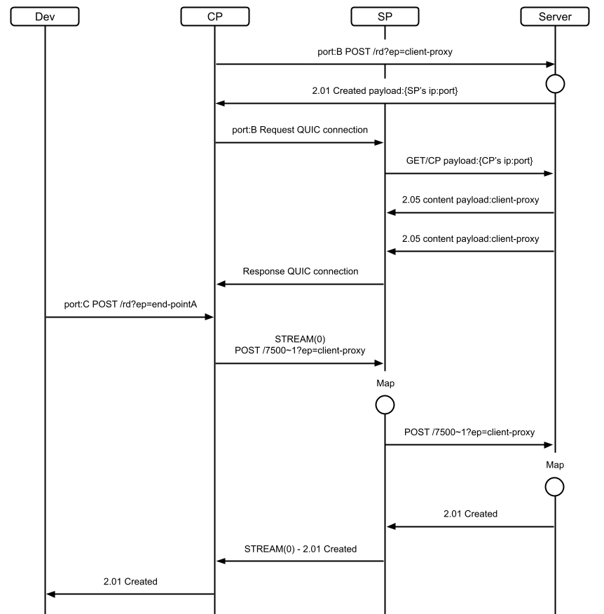
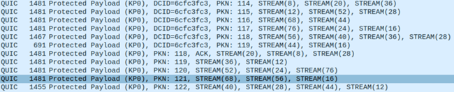
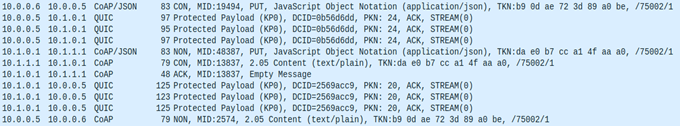
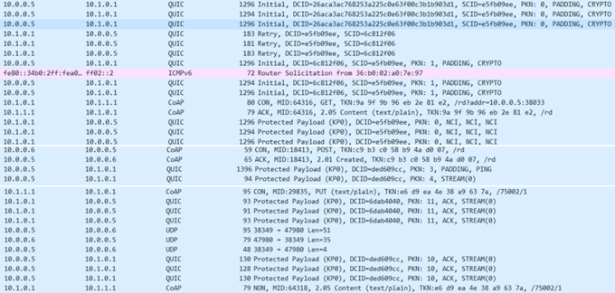

# Mock CompressedCoAP for perforamance analysis

this project is currently in a technical preview state. It will be subject to a lot of modifications and is not yet for general purpose 

## Updating
- Now, We have started to update to move beyond testbed after performance analysis.
we will separate this directory as another repository soon. At that time, we will leave the url here

- we are changing protocol field to C-SEQ

## Todo
- [x] response message token handling
- [x] change token type
- [x] change token table name
- [x] make routine for recv message from SP
- [x] start to implement sp  
- [ ] make test code - doing
- [ ] make ack mechanism - doing 
- [ ] add configuration file

## Design

## Messaging
### Stream aggregation 

### Client to Server

### Server to Client
